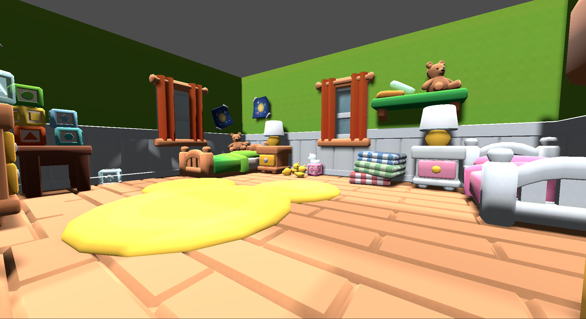
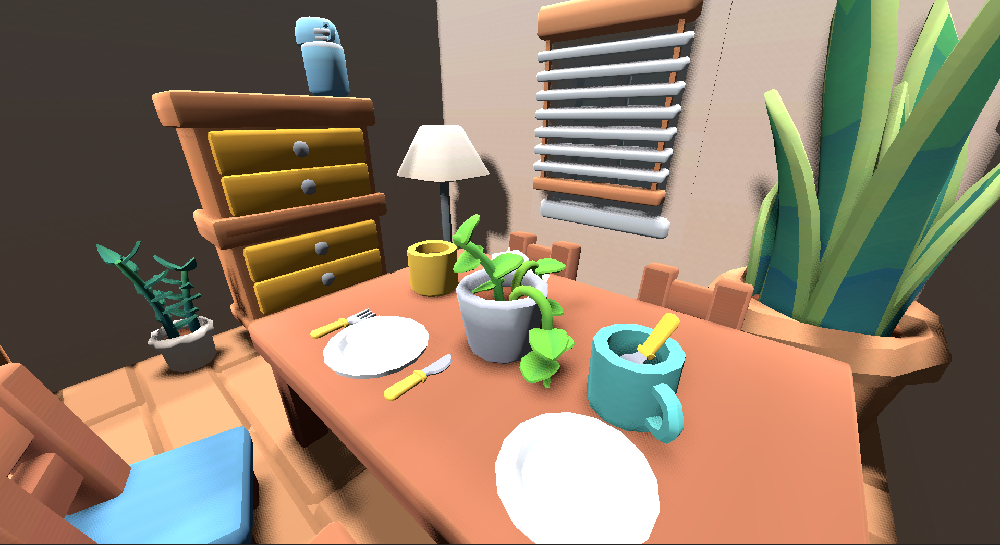
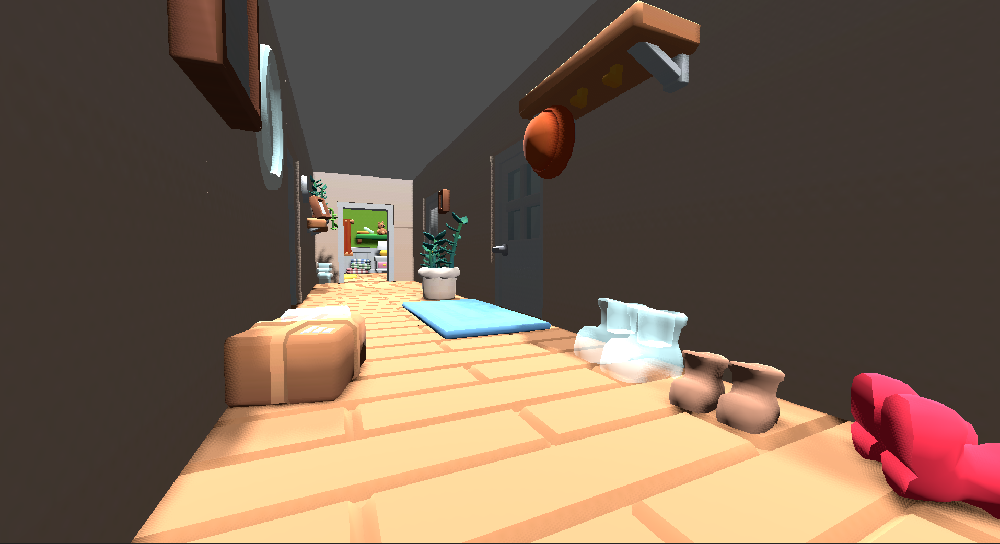
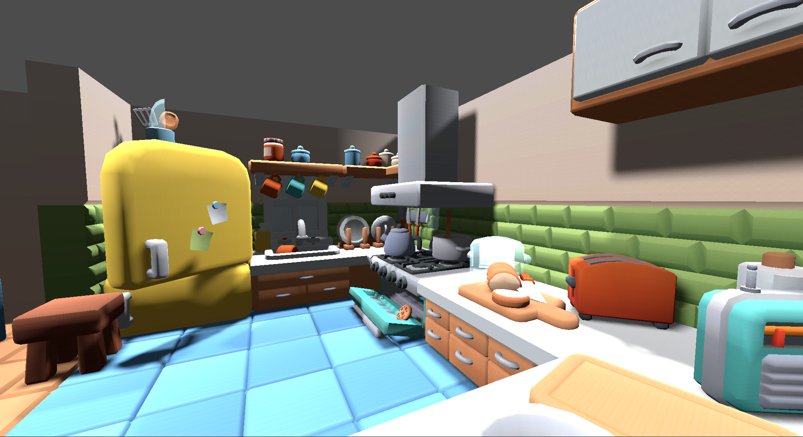
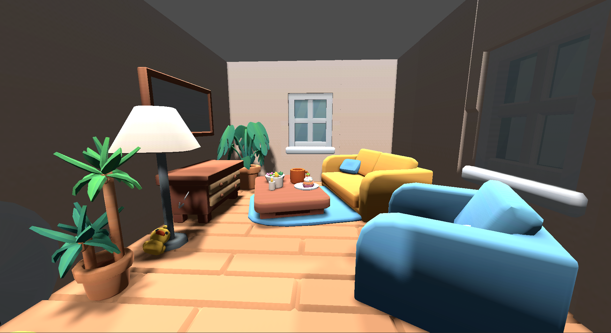
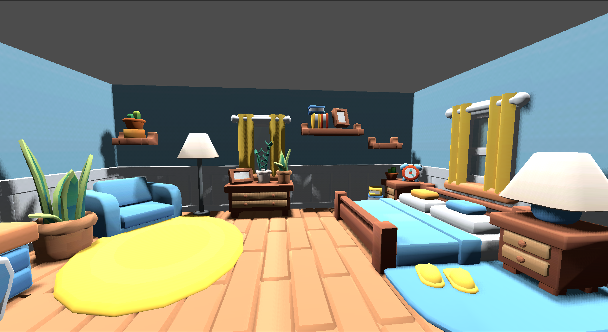

# 🧹 Tidy Up!
Tidy Up! is a small game project inspired by the infamous [Garfield game](https://en.wikipedia.org/wiki/Garfield_(video_game)). Despite its reception, the core idea stuck with me as a nostalgic memory of fun childhood play — especially since it was one of my and my sister’s favorite games growing up.

This project reimagines the concept in a new setting with a different flavor, more modern mechanics adn cute, low-poly grahics.

## ⚙️ Technicalities

* **Engine**: Godot 4.3
* **Language**: GDScript
* **Target Platforms**: Windows & Linux (exported installers available in the [builds](./builds/) directory)

### Core Systems

* **Object Interaction**:
Players can pick up and place objects using a raycast-based system, checking for interactable layers and collision shapes. Each item knows its "correct" position in the world.

* **Inventory System**:
A simple inventory shows currently held objects via UI elements. Items are added and removed dynamically as the player interacts with the world.

* **Placement System**:
Misplaced objects have a corresponding ghostly silhouette indicating their proper place. The silhouettes use transparent material and get removed when the correct item is placed.

### World Design
Rooms Implemented:
The game features a fully furnished house including:
* ✔ Hall
* ✔ Dining Room
* ✔ Kitchen
* ✔ Parents' Bedroom
* ✔ Kids' Bedroom
* ✘ Bathroom (currently inaccessible)

Parkour Elements:
Some objects are placed in hard-to-reach spots, encouraging exploration and basic platforming mechanics like jumping and climbing furniture.

Mischevious agents:
In the future I would like to add some characters into the game, who will be able to obstruct the player, thwart the player's plans and generally make the game more interresting.

### User Interface
* Basic UI showing the current inventory
* Subtle UI hints for interaction points (under construction)
* Ghost object indicators

### 🧱 Assets
Cute, low-poly 3D assets used in this game come from:
* [Tiny Treats](https://tinytreats.itch.io/)
* [Kay Lousberg](https://kaylousberg.itch.io/)

## 🛠️ Installation
The game can be played on:
* 🪟 Windows (`.exe`)
* 🐧 Linux (`.x86_64`)

You’ll find the installation files in the [builds](./builds/) directory.

## 🕹️ Concept
You play as a child left alone at home, trusted with the simple task of keeping the house in order. Unfortunately, you got distracted — maybe you fell asleep, maybe you needed a toilet break... who knows? In the meantime, chaos erupted!

Someone — or something — (a mischievous robot hoover? a younger sibling? a very determined cat?) has created a huge mess. Objects are scattered all over the house: a toaster behind a pot, a rubber duck under the table, shoes on the fridge!

Your job: find misplaced objects and return them to their rightful places before your parents return.

## 🎮 Gameplay Features (Current)
* ✅ Pick up and carry displaced objects
* ✅ Ghostly silhouettes showing where objects should be placed
* ✅ Basic inventory UI
* ✅ A fully furnished house with several rooms:
  * Hall
  * Dining room
  * Kitchen
  * Parents' bedroom
  * Kids' bedroom
* ✅ Basic parkour! Some objects require climbing or clever movement to reach.

## 🚧 Planned Features
While the core mechanics are functional, there’s a lot I’d love to add in the future:
* 😈 A dynamic antagonist (e.g. a vile robot hoover, a messy little sister, or a mischievous cat)
* 💅 Polish the looks (add lighting and a roof)
* 🖼️ Straighten crooked wall paintings
* 🗄️ Interact with drawers and chairs to access high places
* 🚪 Unlockable bathroom
* ⏱️ Time limit — tidy up before the parents come back!
* 🎒 Limited inventory size
* 📋 Objective list in the UI
* 🎬 Simple animations (placing items, floating silhouettes, sparkles, etc.)
* ✨ Flickering lights or effects indicating pickable items
* 🔮 Highlight uncollected items when holding TAB
* 🗨️ Playful inner monologue/comments from the protagonist while placing items
* 🪶 Ambient objects like paper balls, playing cubes, toy train on tracks etc.

## 📸 Screenshots
Here are some visuals from the current version of the game:

